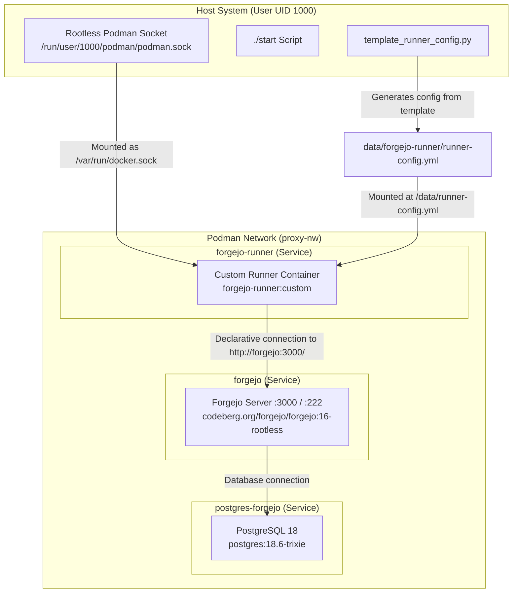

# Forgejo with Actions Runner (Rootless Podman)

A production-ready, rootless containerized setup for [Forgejo](https://forgejo.org/) (a community-driven, self-hosted lightweight Git forge) with PostgreSQL and a custom [Forgejo Actions Runner](https://code.forgejo.org/forgejo/runner).

---

## Table of Contents

- [Architecture](#architecture)
- [Prerequisites](#prerequisites)
- [Quick Start](#quick-start)
  - [1. Enable Rootless Podman Socket](#1-enable-rootless-podman-socket)
  - [2. Create the External Network](#2-create-the-external-network)
  - [3. Start Forgejo and Database](#3-start-forgejo-and-database)
  - [4. Complete Initial Setup & Obtain Runner Token](#4-complete-initial-setup--obtain-runner-token)
  - [5. Template Runner Configuration](#5-template-runner-configuration)
  - [6. Start the Runner](#6-start-the-runner)
- [Generating Runner Configuration](#generating-runner-configuration)
  - [Upstream Example Config Generation](#upstream-example-config-generation)
  - [Configuration Anatomy](#configuration-anatomy)
- [The Python Templating Script (`template_runner_config.py`)](#the-python-templating-script-template_runner_configpy)
  - [Features](#features)
  - [Usage Examples](#usage-examples)
  - [CLI Reference](#cli-reference)
- [Testing Forgejo Actions](#testing-forgejo-actions)
- [Directory Layout](#directory-layout)
- [Operational Commands](#operational-commands)

---

## Architecture



### Components

1. **Forgejo Server** (`codeberg.org/forgejo/forgejo:16-rootless`):
   - Runs in rootless mode mapping user UID/GID (`1000:1000`).
   - Web UI exposed on `http://localhost:3000`.
   - SSH server mapped to port `222` (`localhost:222`).
   - Forgejo Actions enabled (`FORGEJO__actions__ENABLED=true`).
2. **PostgreSQL Database** (`postgres:18.6-trixie`):
   - Stores application state, issues, pull requests, and metadata.
3. **Forgejo Actions Runner** (`forgejo-runner:custom`):
   - Built via [runner.Dockerfile](file:///home/kishen/Documents/code/forgejo/runner.Dockerfile) on top of `data.forgejo.org/forgejo/runner:13.0.0`.
   - Bundles essential build tooling: `nodejs`, `npm`, `bash`, `git`, `curl`, `podman`, and `docker-cli`.
   - Mounts the host's rootless Podman socket to run container-based workflow tasks or runs directly in `host` mode.

---

## Prerequisites

- **Podman** (>= 4.4) and **Podman Compose** (`podman compose` or `podman-compose`).
- **Python 3** (>= 3.9) with `PyYAML` installed:
  ```bash
  python3 -m pip install pyyaml
  ```
- **Systemd User Session** enabled for rootless podman socket.

---

## Quick Start

### 1. Enable Rootless Podman Socket

Forgejo Runner interacts with Podman through the rootless user socket. Enable and start it:

```bash
systemctl --user enable --now podman.socket
```

Verify that the socket is active:

```bash
ls -l /run/user/$(id -u)/podman/podman.sock
```

### 2. Create the External Network

The compose file references an external network named `proxy-nw`. Create it if it doesn't already exist:

```bash
podman network exists proxy-nw || podman network create proxy-nw
```

### 3. Start Forgejo and Database

Run the startup script:

```bash
./start
```

Or run compose directly:

```bash
# Build custom runner image
podman build -t forgejo-runner:custom -f runner.Dockerfile .

# Start containers in background
podman compose -f forgejo.compose.yml up -d server postgres-forgejo
```

*(Note: Don't start the runner container yet if you haven't generated its registration config.)*

### 4. Complete Initial Setup & Obtain Runner Token

1. Open your browser and navigate to **[http://localhost:3000](http://localhost:3000)**.
2. Complete the initial installation form (defaults are preconfigured from environment variables in [forgejo.compose.yml](file:///home/kishen/Documents/code/forgejo/forgejo.compose.yml)).
3. Register your first administrator account.
4. Obtain a **Runner Registration Token**:
   - **Global / Instance-wide Runner** (recommended):
     - Click the **Wrench Icon** (Site Administration) in the top-right corner.
     - Go to **Actions** -> **Runners**.
     - Click **Create new Runner**.
     - Copy the **Registration Token** shown on screen.
   - **Organization or Repository Runner**:
     - Navigate to your Organization or Repository -> **Settings** -> **Actions** -> **Runners** -> **Create new Runner**.

### 5. Template Runner Configuration

Use the provided Python script [template_runner_config.py](file:///home/kishen/Documents/code/forgejo/template_runner_config.py) to generate the runner configuration:

```bash
./template_runner_config.py --token <PASTE_YOUR_REGISTRATION_TOKEN_HERE>
```

Alternatively, copy [.env.example](file:///home/kishen/Documents/code/forgejo/.env.example) to `.env`:

```bash
cp .env.example .env
# Edit .env and paste your token under FORGEJO_RUNNER_TOKEN
./template_runner_config.py
```

This renders [runner-config.template.yml](file:///home/kishen/Documents/code/forgejo/runner-config.template.yml) into `data/forgejo-runner/runner-config.yml` with:
- An automatically generated UUID (or reuses your existing UUID).
- Server connection pointing to `http://forgejo:3000/`.
- Default labels `host:host`.
- Syntax verification via PyYAML.

### 6. Start the Runner

Once the config is generated, start or restart the runner:

```bash
podman compose -f forgejo.compose.yml up -d forgejo-runner
```

Inspect the runner logs to verify successful declaration:

```bash
podman logs -f forgejo-runner
```

You should see:
```text
level=info msg="Starting runner daemon"
level=info msg="runner: runner-1, with version: v13.0.0, with labels: [host], ephemeral: false, declared successfully"
level=info msg="[poller] launched"
```

In the Forgejo Web UI under **Site Administration** -> **Actions** -> **Runners**, your runner will now appear with an **Idle** (green) status.

---

## Generating Runner Configuration

### Upstream Example Config Generation

Forgejo Runner has a built-in CLI command `generate-config` that outputs an annotated reference configuration containing all available configuration fields:

```bash
podman run --rm data.forgejo.org/forgejo/runner:13.0.0 forgejo-runner generate-config > runner-config.reference.yml
```

### Configuration Anatomy

In modern versions of Forgejo Runner (v3.3.0+ and v13+), registration is handled **declaratively** in the configuration file under `server.connections`, replacing the deprecated interactive `forgejo-runner register` CLI command.

Key sections of `runner-config.yml`:

```yaml
log:
  level: info           # Output in daemon logs
  job_level: info       # Output sent back to Forgejo UI for jobs

runner:
  file: .runner         # Internal registration state file
  capacity: 1           # Number of parallel workflow jobs to run concurrently
  labels:
    - "host:host"       # Labels matched against 'runs-on' in workflow files
  timeout: 3h           # Max time a job can run
  shutdown_timeout: 3h  # Grace period when canceling tasks on shutdown
  insecure: false       # Skip TLS certificate validation if using self-signed certs
  fetch_interval: 2s    # How often the runner polls Forgejo for queued jobs

cache:
  enabled: true         # Enables internal actions cache proxy (actions/cache)
  port: 0               # 0 assigns a random available port

container:
  network: ""           # Network used by task containers (empty creates a dedicated bridge)
  privileged: false     # Whether tasks run in privileged mode (required for Docker-in-Docker)
  docker_host: "-"      # '-' disables mounting docker socket into job containers
  valid_volumes: []     # Allowed volumes if jobs require volume mounts

server:
  connections:
    forgejo:
      url: http://forgejo:3000/                    # Forgejo URL reachable from runner container
      uuid: 691ba1cf-a0a0-4a6c-afd2-4cb3cdd54cf1  # Unique runner UUID
      token: <REGISTRATION_TOKEN>                  # Token from Forgejo Actions settings
```

---

## The Python Templating Script (`template_runner_config.py`)

[template_runner_config.py](file:///home/kishen/Documents/code/forgejo/template_runner_config.py) streamlines creating and maintaining `data/forgejo-runner/runner-config.yml`.

### Features

- **Zero-Friction Registration**: Generates a valid UUIDv4 automatically on initial setup.
- **Identity Preservation**: Reuses the existing runner UUID across configuration updates so the runner does not get duplicated in the Forgejo UI.
- **Template-Based**: Substitutes variables into [runner-config.template.yml](file:///home/kishen/Documents/code/forgejo/runner-config.template.yml), preserving all inline comments and formatting.
- **Flexible Input**: Configurable through CLI arguments, `.env` file, or shell environment variables.
- **YAML Validation**: Verifies generated output syntax with PyYAML prior to saving.
- **Dry-Run Mode**: Inspect output without writing to disk.

### Usage Examples

#### 1. Basic Generation with Token
```bash
./template_runner_config.py --token "your-forgejo-runner-token"
```

#### 2. Dry Run Preview (prints to stdout)
```bash
./template_runner_config.py --token "your-token" --dry-run
```

#### 3. Using `.env` File
```bash
cp .env.example .env
# Edit .env: FORGEJO_RUNNER_TOKEN=your-token
./template_runner_config.py
```

#### 4. Custom Labels and Concurrency
```bash
./template_runner_config.py \
  --token "your-token" \
  --capacity 2 \
  --labels "host:host,docker:docker://docker.io/library/node:22-bookworm"
```

#### 5. Force a Brand New Runner Identity
```bash
./template_runner_config.py --token "your-token" --new-uuid
```

### CLI Reference

| Flag | Env Variable | Default | Description |
| :--- | :--- | :--- | :--- |
| `-t`, `--token` | `FORGEJO_RUNNER_TOKEN` | *Required* | Runner registration token from Forgejo UI |
| `-u`, `--url` | `FORGEJO_URL` | `http://forgejo:3000/` | Forgejo instance URL accessible to runner |
| `--uuid` | `FORGEJO_RUNNER_UUID` | Auto / Existing | Specific runner UUID (reuses existing if present) |
| `--new-uuid` | - | `false` | Force generation of a new UUID |
| `-n`, `--name` | - | `forgejo` | Connection name under `server.connections` |
| `-l`, `--labels` | `RUNNER_LABELS` | `host:host` | Comma-separated list of runner labels |
| `-c`, `--capacity` | `RUNNER_CAPACITY` | `1` | Maximum parallel jobs |
| `--timeout` | - | `3h` | Maximum execution timeout for jobs |
| `--shutdown-timeout` | - | `3h` | Graceful shutdown timeout |
| `--docker-host` | - | `-` | Docker host socket override in containers |
| `--container-network` | - | `""` | Container network for workflow steps |
| `--insecure` | - | `false` | Disable TLS certificate verification |
| `--log-level` | - | `info` | Daemon log level (`trace`, `debug`, `info`, etc.) |
| `--template` | - | `runner-config.template.yml` | Custom path to template file |
| `-o`, `--output` | - | `data/forgejo-runner/runner-config.yml` | Destination file path |
| `--env-file` | - | `.env` | Path to `.env` file |
| `--dry-run` | - | `false` | Print to stdout without modifying files |

---

## Testing Forgejo Actions

To verify that your runner executes workflows, create a repository in Forgejo and push a sample workflow file:

### `.forgejo/workflows/test.yml`

```yaml
name: CI Test
on: [push]

jobs:
  run-on-host:
    runs-on: host
    steps:
      - name: Check Environment
        run: |
          echo "Running on Forgejo Runner!"
          uname -a
          node --version
          npm --version
          git --version
          podman --version
```

Push this commit to your repository and open the **Actions** tab in Forgejo to see the live execution logs!

---

## Directory Layout

```text
.
├── .env.example                     # Example environment variable file
├── .gitignore                       # Git ignore rules (protects data & secrets)
├── forgejo.compose.yml              # Podman Compose service definitions
├── runner.Dockerfile                # Custom runner image with dev tools
├── runner-config.template.yml       # Base template with placeholder variables
├── template_runner_config.py        # Python script to generate runner-config.yml
├── start                            # Convenience script to build and launch stack
├── README.md                        # Documentation
├── data/
│   └── forgejo-runner/
│       └── runner-config.yml        # Active runner config (generated, gitignored)
├── forgejo/                         # Forgejo persistent state & repos (gitignored)
└── postgres/                        # PostgreSQL 18 data directory (gitignored)
```

---

## Operational Commands

### Start the entire stack
```bash
./start
```

### Stop all services
```bash
podman compose -f forgejo.compose.yml down
```

### View service logs
```bash
# Runner logs
podman logs -f forgejo-runner

# Forgejo server logs
podman logs -f forgejo

# PostgreSQL logs
podman logs -f postgres-forgejo
```

### Rebuild runner image after Dockerfile changes
```bash
podman build -t forgejo-runner:custom -f runner.Dockerfile .
podman compose -f forgejo.compose.yml up -d forgejo-runner
```
